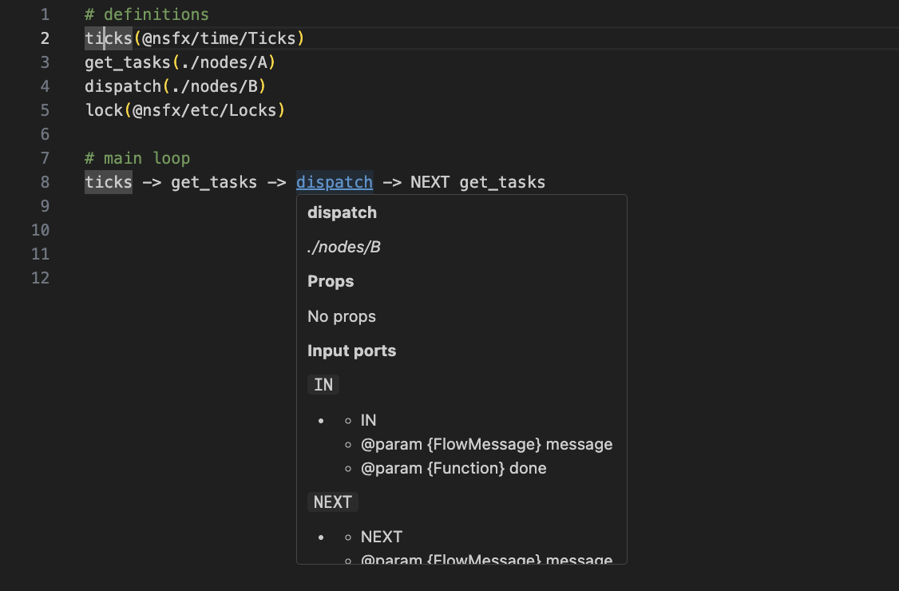

# language-fbp-tools

The `Flow Based Programming` DSL language support with `props` and `ports` description for Visual Studio Code.

Based on:
- [LeuisKen/language-fbp](https://github.com/LeuisKen/language-fbp)
- [paulyoung/FBP.tmbundle](https://github.com/paulyoung/FBP.tmbundle)
- [im4LF/nsfx-utils](https://github.com/im4LF/nsfx-utils)

